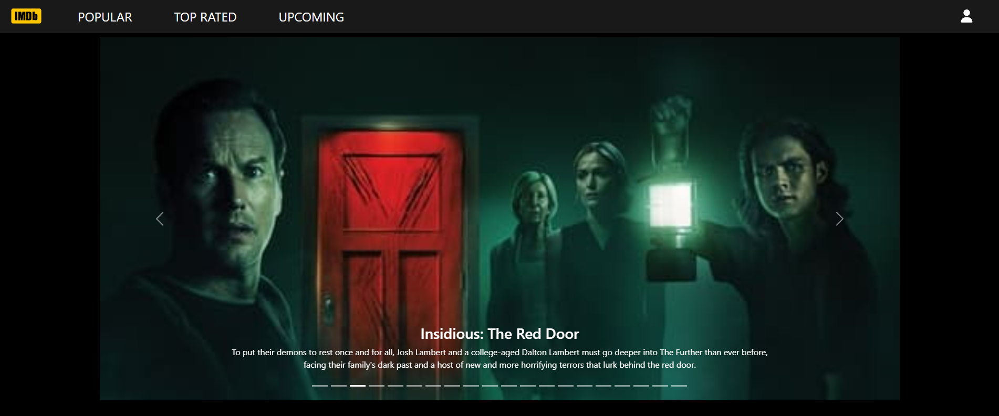

# IMDb Movie App

Welcome to my IMDb Movie App repository! This project is a movie application that allows users to explore and discover movie listings from various categories, including popular, top-rated, and upcoming movies. The app is built using React and integrates with the TMDB API to fetch and display movie data.

## Features

- Browse and explore movie listings from different categories.
- Dynamic routing using `react-router-dom` to navigate between categories and pages.
- Utilization of asynchronous requests with Axios to fetch data from the TMDB API.
- Responsive user interface design with Bootstrap and custom SCSS styles.
- Pagination with conditional styling for smooth navigation through movie lists.

## Technologies Used

- React
- React Router
- Axios
- Bootstrap
- SCSS

## Outcome 

